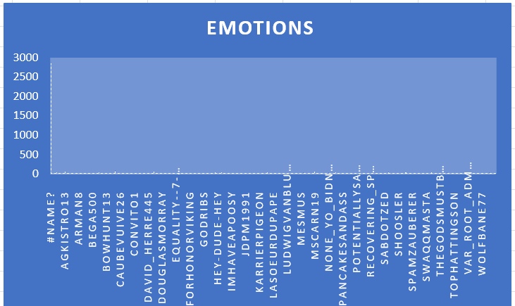

# map-reduce-maruthi
Hello I am practising map reduce

# Type of Data 
The data I have choosen for this assigment is about the carefully curated comments extracted from Reddit with human annotations to 27 emotion categories or Neutral.The data consists of the of the various details such as author and their respective comments,and their respective human related emotion and their rating.The Data totally consists of 37 columns and count of 21126 records.I have extracted this data from Kaggle.

Link for Data : [Data](https://www.kaggle.com/mathurinache/goemotions)

# Big Data problem

The Big data problem I have choosen is to extract the overall admiration rate for each author.

# Data story 
The output data mainly narrates about the differnt authors and their count in the admiration emotion .The detailed analysis is shown in the form of the graph.In the below graph we can clearly see that admiration level for each author.Similar to the admiration we can map the authors and their respective ratings with other 27 human emotions as listed in the data file in the similar but i choose to implement based on the admiration rate

