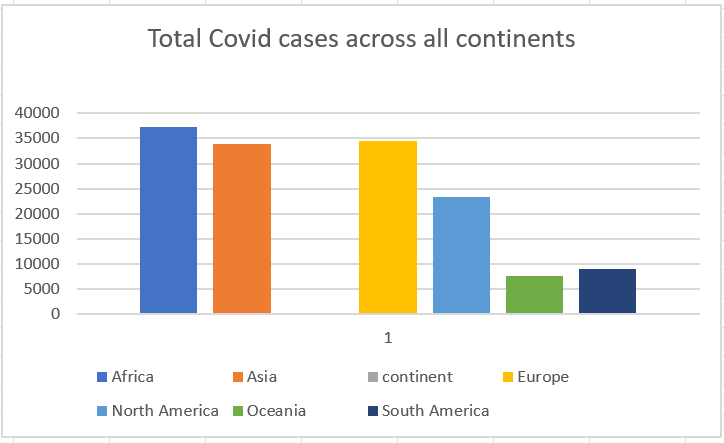

# map-reduce-maruthi
Hello I am practising map reduce

# Type of Data 
The data I have choosen for this assigment is about the covid 19 dataset for corana virus pandameic.The data primarly consists of various factors related to covid 19 such as total_cases,new_cases and many more.The data set I have choosen consists of 67 different data columns with the continent,respective locations and many more.The dataset consists of 155709 records.

Link for Data : [Data](https://www.kaggle.com/georgesaavedra/covid19-dataset)

# Big Data problem

The Big data problem I have choosen is to extract the  total cases of covid-19 per each continent.

# Data story 
I have analyzed the data of covid-19 across all the continents and the visualization presented below clearly represents the total number of cases across each continent.This gives a clear explanation of which continent has highest number of cases and which has lowest.

